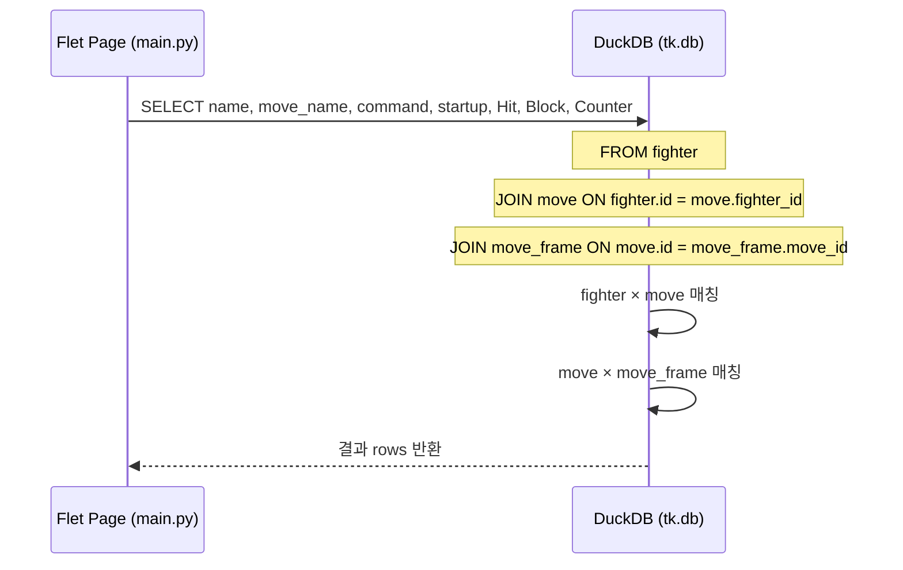

```mermaid
sequenceDiagram
    participant Page as Flet Page (main.py)
    participant DB as DuckDB (tk.db)

    Page->>DB: SELECT name, move_name, command, startup, Hit, Block, Counter
    note over DB: FROM fighter
    note over DB: JOIN move ON fighter.id = move.fighter_id
    note over DB: JOIN move_frame ON move.id = move_frame.move_id
    DB->>DB: fighter × move 매칭
    DB->>DB: move × move_frame 매칭
    DB-->>Page: 결과 rows 반환
```
