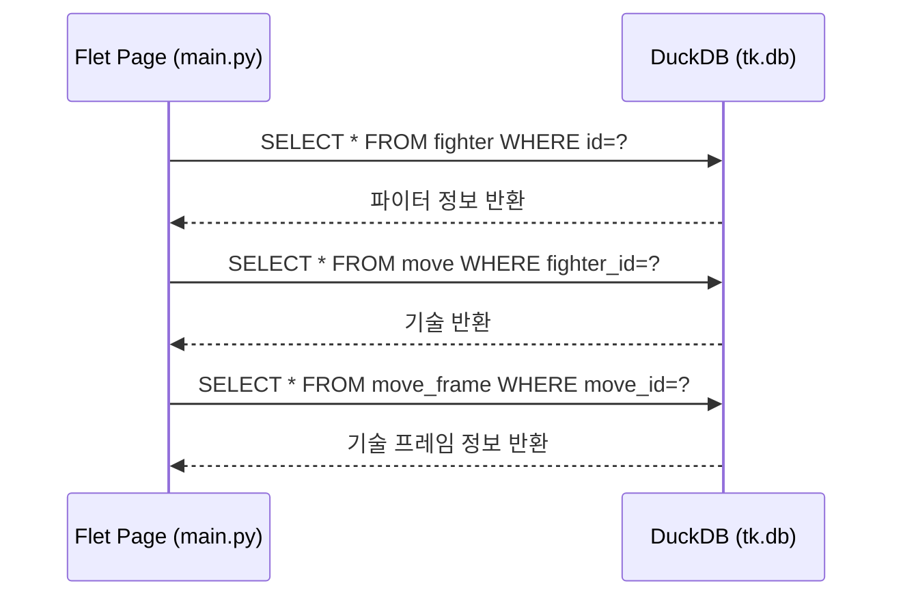

```mermaid
sequenceDiagram
    participant Page as Flet Page (main.py) 
    participant DB as DuckDB (tk.db) 
    Page->>DB: SELECT * FROM fighter WHERE id=? 
    DB-->>Page: 파이터 정보 반환 
    Page->>DB: SELECT * FROM move WHERE fighter_id=? 
    DB-->>Page: 기술 반환 
    Page->>DB: SELECT * FROM move_frame WHERE move_id=? 
    DB-->>Page: 기술 프레임 정보 반환
```
