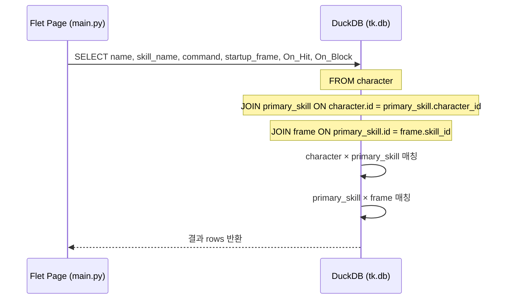

```mermaid
sequenceDiagram
    participant Page as Flet Page (main.py)
    participant DB as DuckDB (tk.db)

    Page->>DB: SELECT name, skill_name, command, startup_frame, On_Hit, On_Block
    note over DB: FROM character
    note over DB: JOIN primary_skill ON character.id = primary_skill.character_id
    note over DB: JOIN frame ON primary_skill.id = frame.skill_id
    DB->>DB: character × primary_skill 매칭
    DB->>DB: primary_skill × frame 매칭
    DB-->>Page: 결과 rows 반환
```
