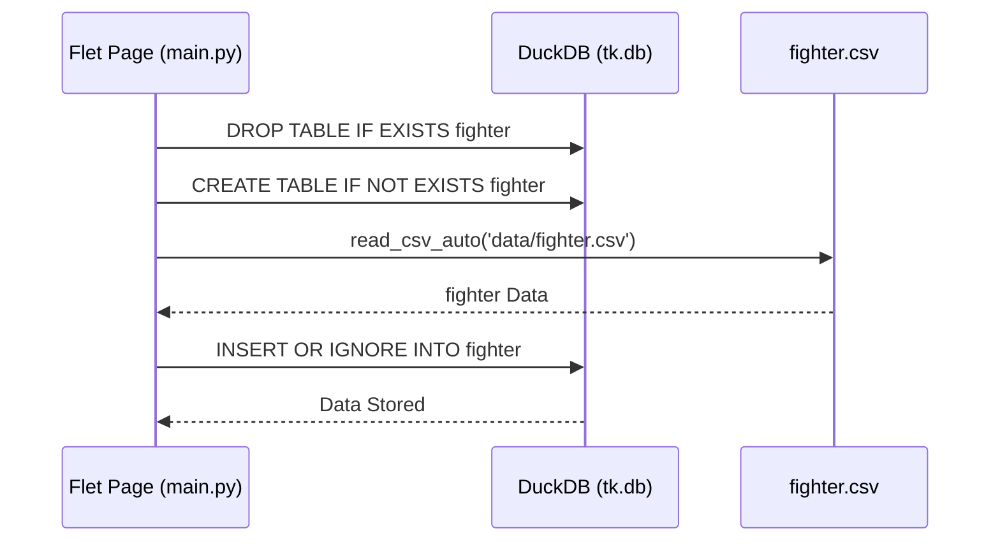

```mermaid
sequenceDiagram
    participant Page as Flet Page (main.py)
    participant DB as DuckDB (tk.db)
    participant CSV as fighter.csv

    Page->>DB: DROP TABLE IF EXISTS fighter
    Page->>DB: CREATE TABLE IF NOT EXISTS fighter
    Page->>CSV: read_csv_auto('data/fighter.csv')
    CSV-->>Page: fighter Data
    Page->>DB: INSERT OR IGNORE INTO fighter
    DB-->>Page: Data Stored
```