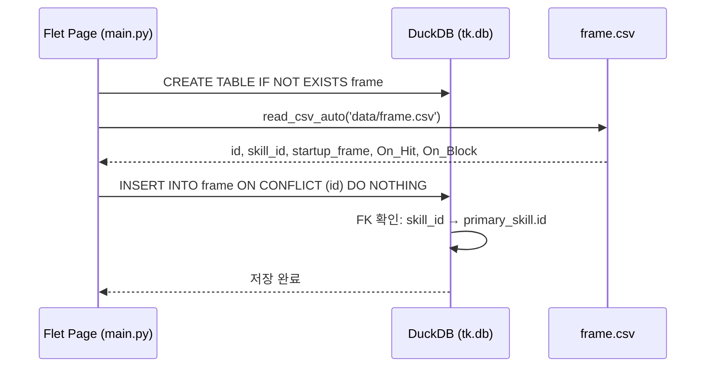

```mermaid
sequenceDiagram
    participant Page as Flet Page (main.py)
    participant DB as DuckDB (tk.db)
    participant CSV as frame.csv

    Page->>DB: CREATE TABLE IF NOT EXISTS frame
    Page->>CSV: read_csv_auto('data/frame.csv')
    CSV-->>Page: id, skill_id, startup_frame, On_Hit, On_Block
    Page->>DB: INSERT INTO frame ON CONFLICT (id) DO NOTHING
    DB->>DB: FK 확인: skill_id → primary_skill.id
    DB-->>Page: 저장 완료
```