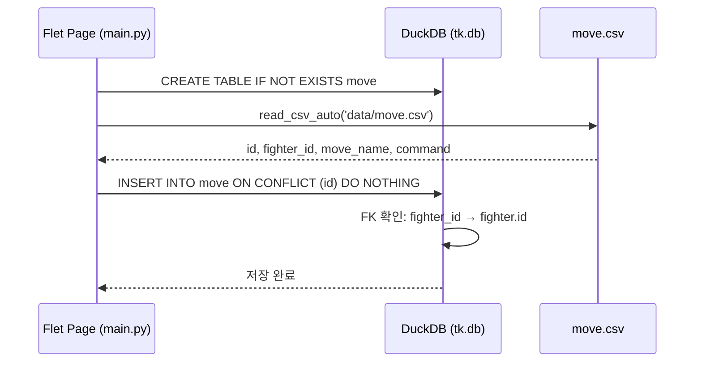

```mermaid
sequenceDiagram
    participant Page as Flet Page (main.py)
    participant DB as DuckDB (tk.db)
    participant CSV as move.csv

    Page->>DB: CREATE TABLE IF NOT EXISTS move
    Page->>CSV: read_csv_auto('data/move.csv')
    CSV-->>Page: id, fighter_id, move_name, command
    Page->>DB: INSERT INTO move ON CONFLICT (id) DO NOTHING
    DB->>DB: FK 확인: fighter_id → fighter.id
    DB-->>Page: 저장 완료
```