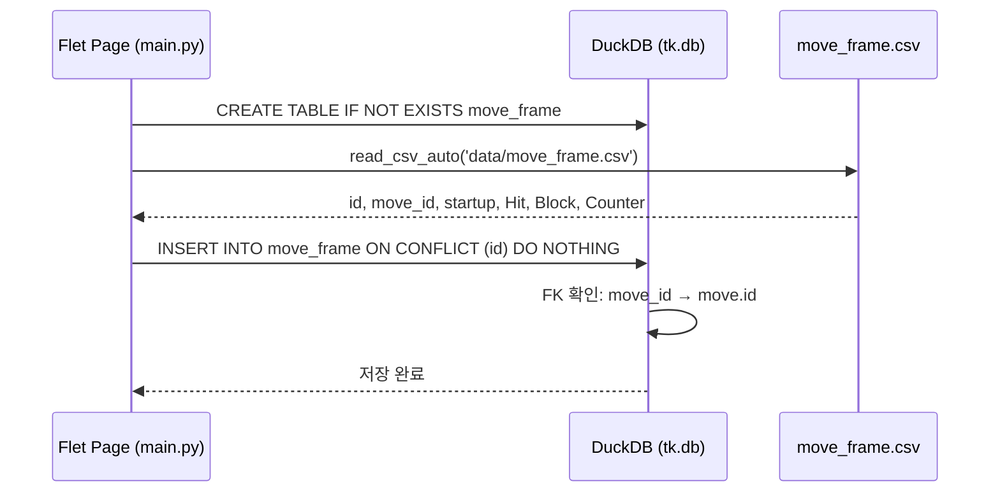

```mermaid
sequenceDiagram
    participant Page as Flet Page (main.py)
    participant DB as DuckDB (tk.db)
    participant CSV as move_frame.csv

    Page->>DB: CREATE TABLE IF NOT EXISTS move_frame
    Page->>CSV: read_csv_auto('data/move_frame.csv')
    CSV-->>Page: id, move_id, startup, Hit, Block, Counter
    Page->>DB: INSERT INTO move_frame ON CONFLICT (id) DO NOTHING
    DB->>DB: FK 확인: move_id → move.id
    DB-->>Page: 저장 완료
```