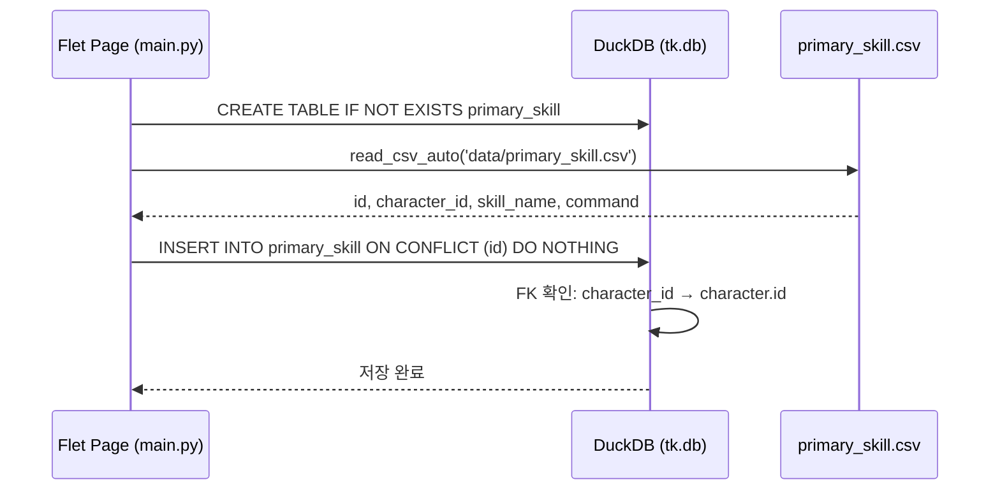

```mermaid
sequenceDiagram
    participant Page as Flet Page (main.py)
    participant DB as DuckDB (tk.db)
    participant CSV as primary_skill.csv

    Page->>DB: CREATE TABLE IF NOT EXISTS primary_skill
    Page->>CSV: read_csv_auto('data/primary_skill.csv')
    CSV-->>Page: id, character_id, skill_name, command
    Page->>DB: INSERT INTO primary_skill ON CONFLICT (id) DO NOTHING
    DB->>DB: FK 확인: character_id → character.id
    DB-->>Page: 저장 완료
```